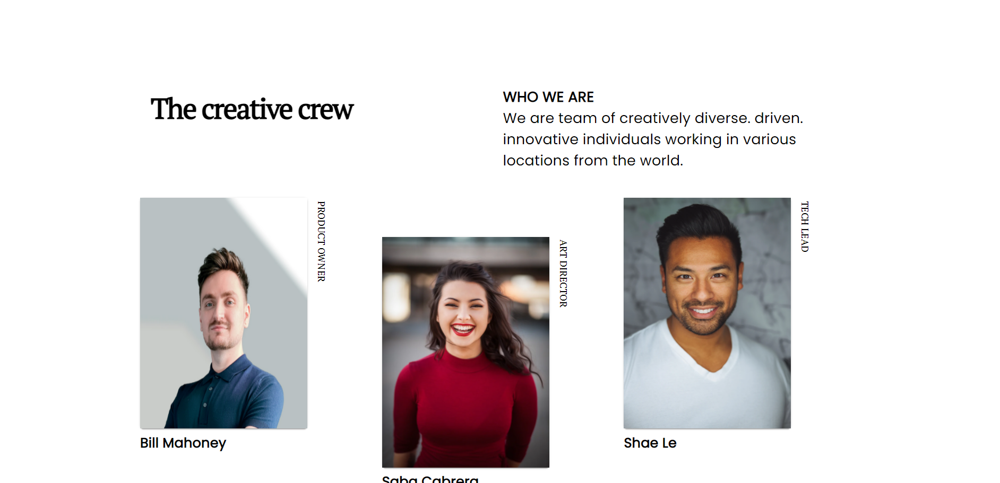
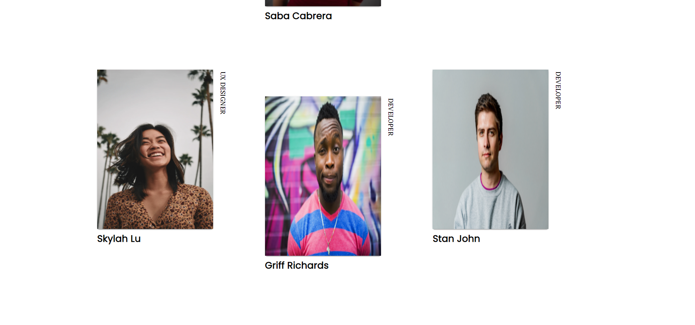
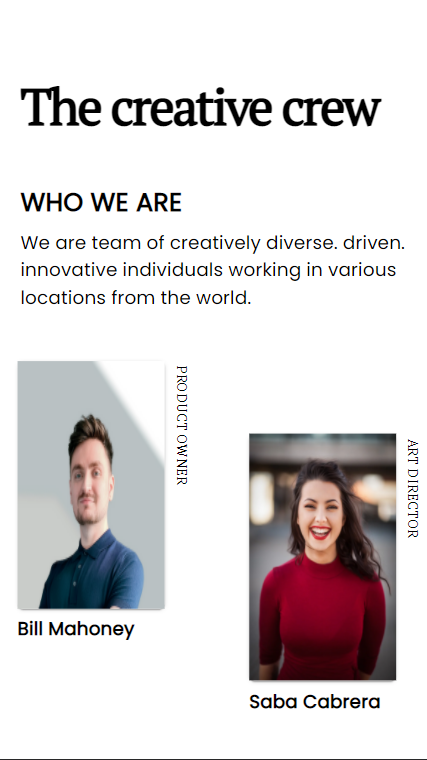
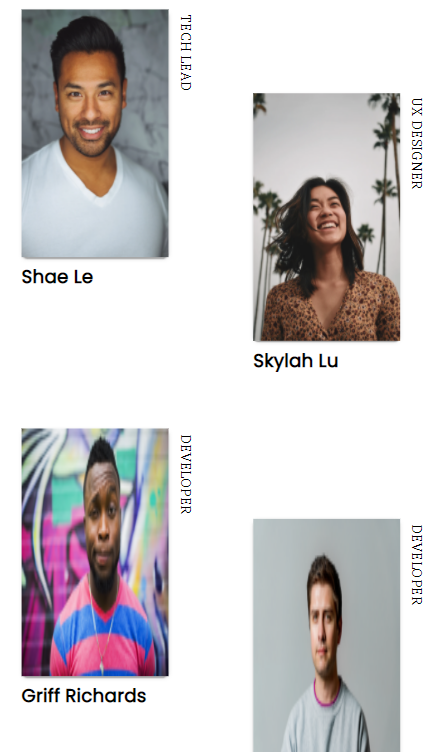

## Link : https://devchallenge-priya.netlify.app/
<!-- Please update value in the {}  -->

<h1 align="center">My Team Page</h1>

   Solution for a challenge from  <a href="http://devchallenges.io" target="_blank">Devchallenges.io</a>.

  <h3>
    <a href="https://devchallenge-priya.netlify.app/">
      Demo
    </a>
     | 
    <a href="https://github.com/Priya2123/My-Team-Page">
      Solution
    </a>
     | 
    <a href="https://devchallenges.io/challenges/hhmesazsqgKXrTkYkt0U">
      Challenge
    </a>
  </h3>

<!-- TABLE OF CONTENTS -->

## Table of Contents

- [Overview](#overview)
  - [Built With](#built-with)
- [Features](#features)
- [Contact](#contact)

<!-- OVERVIEW -->

## Overview

I've completed the 'My Team Page Challenge'. This one was pretty fun. 

### Built With

<!-- This section should list any major frameworks that you built your project using. Here are a few examples.-->

- Reactjs
- CSS
- Material ui

## Features

<!-- List the features of your application or follow the template. Don't share the figma file here :) -->

This application/site was created as a submission to a [DevChallenges](https://devchallenges.io/challenges) challenge. The [challenge](https://devchallenges.io/challenges/hhmesazsqgKXrTkYkt0U) was to build an application to complete the given user stories.

## Contact

- GitHub [@Priya-Aggarwal](https://github.com/Priya2123)

## Contributing

Pull requests are welcome. For major changes, please open an issue first to discuss what you would like to change.
